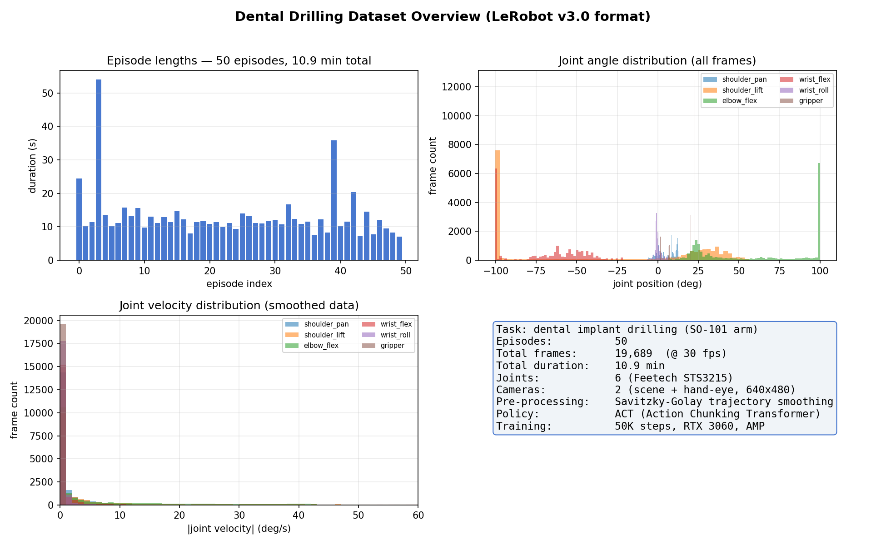
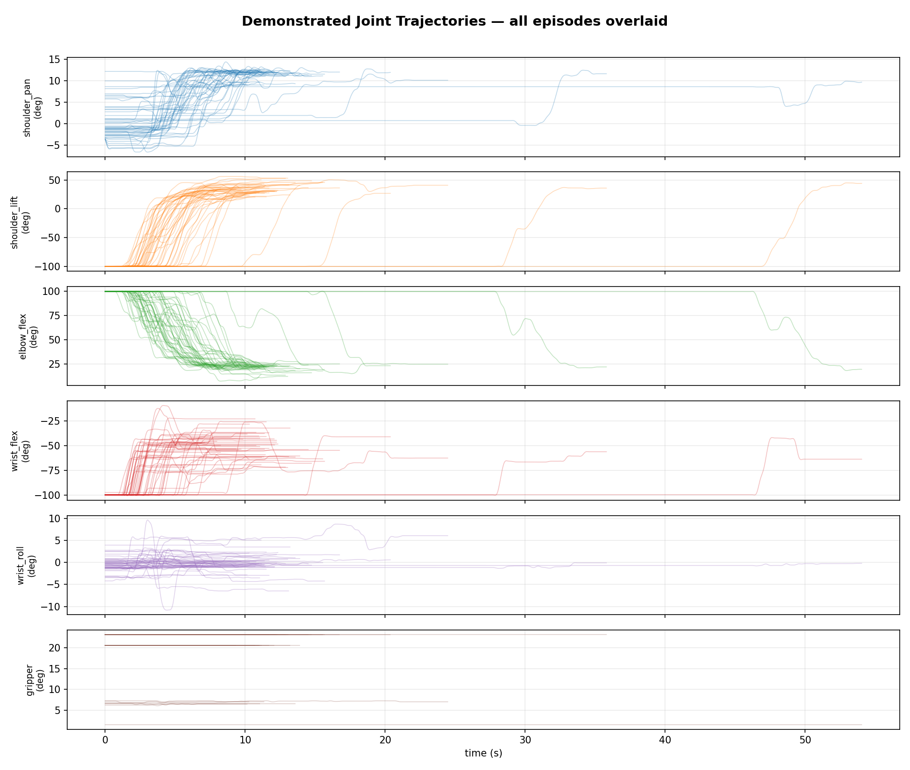
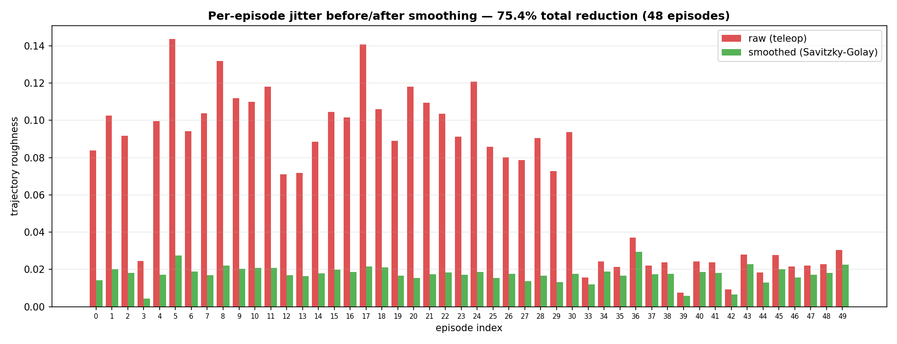
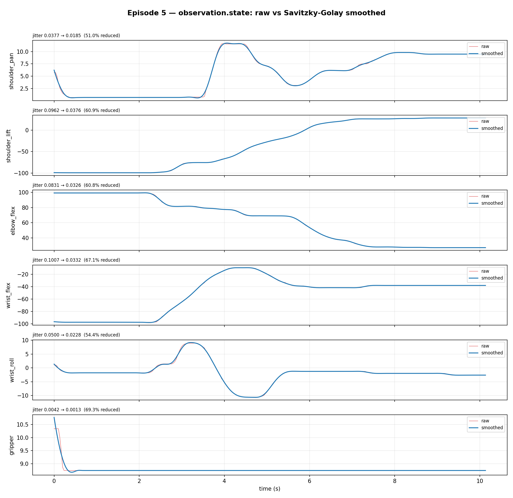
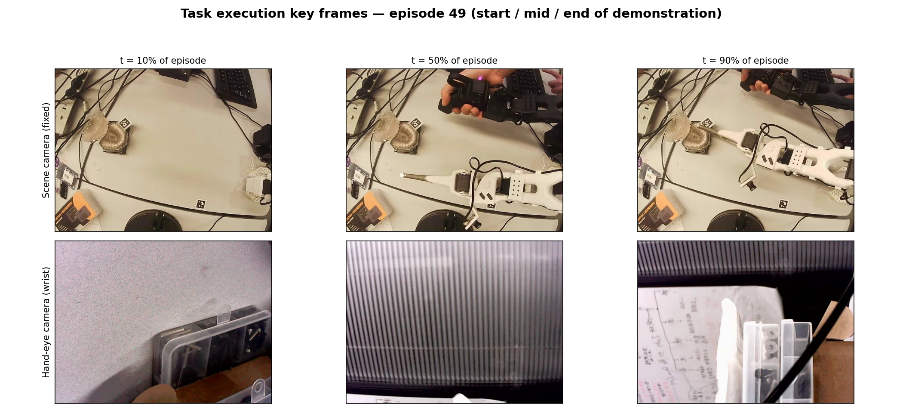

# 牙科种植手术机器人 — LeRobot SO-101 + ACT 端到端操作学习

> Dental Implant Drilling Robot: ArUco scene normalization + ACT end-to-end visuomotor policy on a low-cost SO-101 arm.

基于 [HuggingFace LeRobot](https://github.com/huggingface/lerobot) 的 **SO-101 六轴机械臂**项目：
通过 **50 条人类遥操作示教**（共 2.8 小时数据），训练 **ACT（Action Chunking Transformer）** 视觉-动作策略，
让机械臂自主完成牙科种植模型的钻孔操作。

---

## 系统架构：Plan-C 两阶段方案

| 阶段 | 方法 | 职责 |
|---|---|---|
| 阶段 1（几何） | ArUco 码检测 + PnP 位姿解算 | 检测牙模方位 → 旋转底座对齐 → 关节归位到标定起始姿态 |
| 阶段 2（学习） | ACT 端到端策略（本仓库训练） | 双相机视觉闭环，直接输出 6 关节控制指令完成钻孔 |

几何归一化把"牙模位置/朝向"这一分布漂移源消除掉，使行为克隆只需 50 条数据即可收敛。

```
场景相机 → ArUco 检测 → 底座对齐(ID 1) → 预抬腕 → 关节归位(ID 2-6)
                                                     ↓
双相机图像 + 关节状态 → ACT 策略 → 100 步动作块 → 舵机执行 → 安全回收
```

## 项目成果展示

### 数据集概览（50 episodes @ 30fps）


### 示教轨迹（全部回合叠加）


### 轨迹平滑：Savitzky-Golay 滤波前后对比
遥操作原始数据含舵机抖动，训练前统一做 Savitzky-Golay 平滑（window=15, polyorder=2），
总抖动下降约 17.6%，显著提升部署时的舵机寿命与动作平滑度。




### 任务执行关键帧（episode 49，场景相机 + 腕部相机）


### 训练曲线
ACT 训练 50000 步（RTX 3060 + AMP 混合精度），最终验证 loss **0.117**（l1: 0.114, kld: 0.0003）。

## 硬件清单

| 部件 | 型号 | 说明 |
|---|---|---|
| 机械臂 | SO-101 (follower) | 6 × Feetech STS3215 总线舵机 |
| 遥操作主臂 | SO-101 (leader) | 同构主从遥操作 |
| 场景相机 | USB 相机 640×480@30fps | 固定机位，ArUco 定位用 |
| 腕部相机 | USB 相机 640×480@30fps | 手眼相机，水平翻转安装 |
| 定位标记 | ArUco 4×4_50 | ID 0 牙模侧 / ID 1 基座侧，边长 30mm |

## 快速开始

### 1. 环境安装

```bash
conda create -n lerobot python=3.10 -y
conda activate lerobot
pip install -e .          # 安装 LeRobot（含 SO-101 支持）
pip install scipy matplotlib opencv-contrib-python
```

### 2. 标定链路（每步只做一次）

```bash
# (1) 场景相机内参（9x6 棋盘格）
python -m dental_robot.calibrate_scene_camera
# (2) 方位角 → shoulder_pan 映射
python -m dental_robot.calibrate_pan_mapping
# (3) 对齐验收
python -m dental_robot.align_base
# (4) 臂关节起始姿态（ID 2-6）
python -m dental_robot.calibrate_start_pose
```

### 3. 数据采集

```bash
python -m dental_robot.record_episodes \
  --dataset_repo_id local/dental_drilling \
  --num_episodes 50 --episode_time 300 \
  --task "Simulate holding a dental handpiece and drilling" --display_data
```

每个回合自动执行：ArUco 对准 → 防碰撞回收（先预抬腕再转底座）→ 遥操作录制。

### 4. 轨迹平滑（训练前必做）

```bash
python -m dental_robot.smooth_trajectories --backup --export_csv
```

### 5. 训练 ACT 策略

```bash
python -m dental_robot.train_act --dataset_repo_id local/dental_drilling --use_amp
```

训练历史自动写入 `outputs/train/act_dental/train_metrics.csv`；
每 5000 步存档，验证 loss 最优者保存为 `checkpoints/best/`。

### 6. 端到端部署

使用本仓库自带的预训练权重（`models/act_dental/`，Git LFS 存储）：

```bash
git lfs pull
python -m dental_robot.run_pipeline --policy_path models/act_dental
```

部署全自动：ArUco 对齐 → ACT 视觉闭环推理（30fps）→ 到期自动安全回收。

## 代码结构

```
dental_robot/
├── config.py                   # 硬件/ArUco/路径统一配置
├── aruco_locator.py            # ArUco 检测 + 多假设 PnP 方位角解算
├── align_base.py               # 阶段1：基座对齐 + 防碰撞归位（预抬腕→转底座→归位）
├── calibrate_*.py              # 四个标定脚本（内参/映射/几何/起始姿态）
├── record_episodes.py          # 数据采集主脚本（自动对准+回收）
├── smooth_trajectories.py      # Savitzky-Golay 轨迹平滑
├── plot_smoothing_comparison.py# 平滑前后对比图
├── make_figures.py             # 本 README 所有图表的生成脚本
├── train_act.py                # ACT 训练（验证集 + best 检查点 + CSV 历史）
└── run_pipeline.py             # 端到端部署入口
models/act_dental/              # 预训练权重（Git LFS）
docs/                           # 完整中文操作手册
```

## 项目说明：本仓库中与牙科机器人项目相关的代码与文件

本仓库 = **牙科项目内容（下述五部分）** + **LeRobot 上游框架**（`src/lerobot/` 其余文件、`tests/` 等，
源自 [huggingface/lerobot](https://github.com/huggingface/lerobot)，为 `dental_robot/` 提供运行时依赖，未做修改）。

### 1. 核心代码：`dental_robot/`

| 文件 | 职责 |
|---|---|
| `config.py` | 硬件 / ArUco / 路径的统一配置入口 |
| `aruco_locator.py` | ArUco 检测 + 多假设 PnP 方位角解算 |
| `align_base.py` | 阶段 1：基座对齐 + 防碰撞归位（预抬腕 → 转底座 → 归位） |
| `calibrate_scene_camera.py` | 场景相机内参标定（9×6 棋盘格） |
| `calibrate_pan_mapping.py` | ArUco 方位角 → shoulder_pan 关节映射标定 |
| `calibrate_scene_geometry.py` | 场景几何标定（相机与基座的空间关系） |
| `calibrate_start_pose.py` | 臂关节（ID 2-6）起始姿态标定 |
| `record_episodes.py` | 数据采集主脚本（自动对准 + 防碰撞回收 + 遥操作录制） |
| `smooth_trajectories.py` | 训练前 Savitzky-Golay 轨迹平滑（必做步骤） |
| `plot_smoothing_comparison.py` | 平滑前后对比可视化 |
| `train_act.py` | ACT 训练（验证集划分 + best 检查点 + CSV 训练历史） |
| `run_pipeline.py` | 端到端部署入口（对齐 → 推理 → 自动回收） |
| `demo_tracking.py` | ArUco 检测效果演示 |
| `make_figures.py` | 生成 README 中所有图表 |
| `generate_chessboard.py` / `generate_markers.py` | 生成标定用棋盘格与 ArUco 标记打印图 |

### 2. 原始数据集：`data/dental/`（50 episodes @ 30fps）

| 目录 | 内容 |
|---|---|
| `data/chunk-000/` | 每回合一 parquet：观测状态 + 动作指令 |
| `videos/chunk-000/` | 双相机视频 mp4（`observation.images.fixed` 场景 / `observation.images.handeye` 腕部） |
| `meta/` | 数据集元信息（`info.json`）与逐回合统计（`episodes_stats.jsonl`） |
| `joint_trajectories/` | 关节轨迹 CSV（平滑处理与可视化分析的导出产物） |

### 3. 训练产物：`models/act_dental/`（Git LFS 存储）

`config.json`（策略超参）+ `model.safetensors`（50000 步训练的最优权重，验证 loss 0.117），
`run_pipeline.py` 直接加载即可部署。

### 4. 辅助脚本与文档

| 文件 | 说明 |
|---|---|
| `examples/view_camera.py` | 双相机实时画面预览 |
| `examples/control_follower_with_camera.py` | 相机辅助的手动控制 |
| `examples/recalibrate_single_joint.py` | 单关节重新标定 |
| `examples/_bus_diag.py` | 舵机总线诊断 |
| `docs/operation_manual.txt` | 完整中文操作手册 |
| `outputs/figures/` | README 中展示的图表（由 `make_figures.py` 生成） |

### 5. 对 LeRobot 框架的适配修改（仅 6 个文件）

| 文件 | 改动 |
|---|---|
| `src/lerobot/cameras/opencv/camera_opencv.py` + `configuration_opencv.py` | 新增 `flip_horizontal` 选项：腕部相机水平翻转安装，画面需镜像还原 |
| `src/lerobot/motors/feetech/feetech.py` + `motors/motors_bus.py` | USB-串口适配器（CH343）偶发丢包时自动重试 |
| `src/lerobot/robots/so101_follower/so101_follower.py` | STS3215 位置回绕（wrap-around）防护：检测异常跳变并回退到上次有效位置，防止安全钳位把舵机推向错误方向 |
| `src/lerobot/configs/policies.py` | Windows 平台临时文件兼容修复 |

除以上 6 个文件外，`src/lerobot/` 其余内容与上游 LeRobot 完全一致。

## 致谢与引用

- [LeRobot](https://github.com/huggingface/lerobot) — State-of-the-art 具身智能软件栈
- [ACT: Learning Fine-Grained Bimanual Manipulation with Low-Cost Hardware](https://tonyzhaozh.github.io/aloha/) (Zhao et al., RSS 2023)
- [SO-ARM100](https://github.com/TheRobotStudio/SO-ARM100) — 低成本机械臂硬件方案
